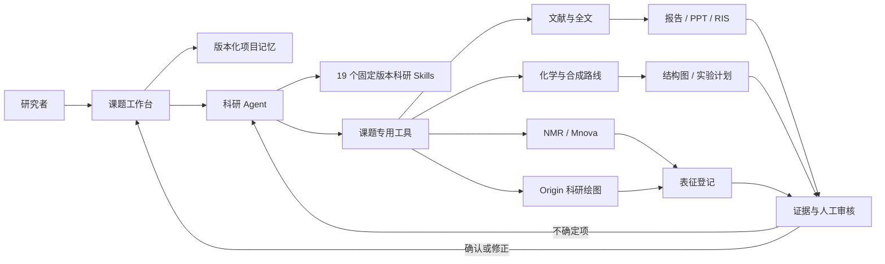
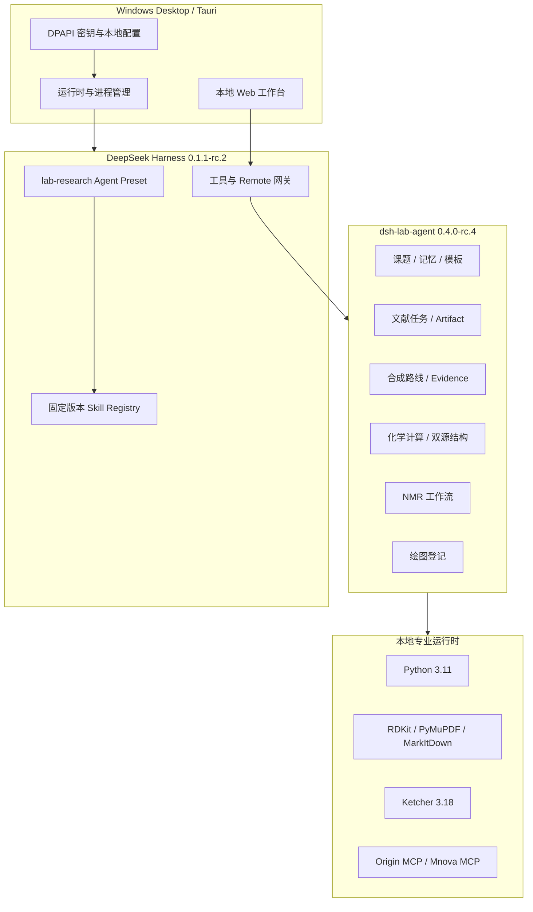

# iBM 科研 Agent


> **让科研 Agent 不止“回答问题”，而是围绕一个真实课题持续工作、保存证据、生成可交付成果，并把关键决定交还给研究者。**

参赛版本：`0.4.0-rc.4`
项目形态：Windows 本地桌面应用 + DeepSeek Harness 独立插件
首期领域：聚前药、高分子材料设计与化学实验科研工作流

---

## 一、项目简介

iBM 科研 Agent 是一套面向实验室和课题组的**本地科研工作台**。

它不是一次性聊天机器人，也不是把多个 AI 按钮放在同一页面，而是把科研过程中原本分散的工作——文献检索、全文精读、合成路线设计、化合物结构核验、实验计划、NMR 分析、科研绘图和成果归档——组织为一个围绕课题持续运行的 Agent 工作流。

系统以“课题”为基本单位。每个课题拥有独立工作空间、版本化项目记忆、文献资料、研究设计、表征结果和审核记录。Agent 可以读取课题上下文、调用专业 Skill 和工具、生成结构化成果并登记到面板；研究者负责检查原始证据、修正不确定信息和锁定最终版本。

一句话概括：

> **iBM 科研 Agent = 长期课题记忆 + 专业科研工具链 + 证据可追溯 + 人机协同审核。**

## 二、我们要解决什么问题

通用大模型已经能够总结论文或生成实验建议，但在真实科研环境中仍有四个明显断点：

1. **对话没有课题连续性**：不同会话之间的目标、材料体系、已有结果和团队约束容易丢失。
2. **答案与原始证据脱节**：结论往往缺少 PDF/SI 页码、截图和来源快照，难以复核。
3. **文本与专业软件脱节**：化学结构、NMR、Origin 图和 Office 成果仍需人工在多个工具间搬运。
4. **生成与决策边界模糊**：AI 建议可能被误当成已经确认的实验事实，缺少锁定、审核和版本机制。

iBM 科研 Agent 的设计目标不是替代科研人员，而是让 Agent 承担高重复、跨工具、重整理的工作，同时把事实确认、实验执行和高风险授权保留给人。

## 三、核心方案



系统形成一个闭环：

```text
理解课题 → 检索/调用工具 → 生成结构化成果 → 登记来源与版本
        → 用户核验关键事实 → Agent 处理未确定项 → 锁定可追溯版本
```

这个闭环是本项目与普通科研聊天机器人的核心差异。

## 四、主要功能

### 1. 课题级长期记忆

- 一个课题对应一个独立 workspace。
- 同一课题内的多个对话共享项目绑定和核心记忆。
- 项目记忆以 Markdown 落盘，同时在系统中保存版本、变更说明和摘要。
- Agent 通过专用工具读取和更新记忆，不把整份历史反复塞入输入框。
- 历史版本可追溯，新版本不会覆盖旧版本。

这让 Agent 能够持续理解“我们正在做什么、已经做过什么、下一步为什么这样做”。

### 2. 文献全流程

系统覆盖从检索到交付的完整链路：

- 多源文献检索、去重与排序；
- DOI、题名、作者和年份校验；
- RIS 汇总与文献条目登记；
- 开放获取优先、机构授权会话后备；
- PDF 与 Supporting Information 归档；
- 精读目标和阅读笔记模板；
- 中英文精读报告；
- 文献汇报 PPT；
- DOCX/PPTX 预览、人工审核与本地保存。

文献成果不是停留在聊天消息中，而是带来源、模板快照和文件摘要的正式课题资产。

### 3. 三段式合成路线工作台

合成路线工作台围绕“图优先、文字辅助”设计，由上到下分为三个横向组件：

1. **合成总览**：展示完整路线，每一步均包含 Ketcher 渲染的反应物和产物结构、名称与 CAS。
2. **步骤详情**：左侧反应物、中央反应箭头和条件、右侧产物，并给出 50 字以内的步骤难点分析和实验计划入口。
3. **事实核验**：左侧为 Agent 从论文正文/SI 提取的格式化事实，右侧为对应页的原文截图。

点击总览中的任一步，详情和事实核验区域同步切换。研究者可以直接新建路线、添加步骤，也可以让 Agent 修改尚未锁定的版本。

### 4. 基于原文截图的事实审核

系统不允许仅凭模型输出把事实标记为确定：

- 原文截图真正生成并在界面显示后，才允许确认或修正。
- 核验记录绑定原文文件、页码、定位区域和内容摘要。
- PDF、页码或定位变化后，旧核验自动失效。
- 用户可选择“确认”“修正”或“无法确认”。
- 无法确认的项目组成新批次交给 Agent 继续处理。
- Agent 不能覆盖人工已经确认或修正的事实。

这使“AI 提取—人类核验—AI 补全”成为可审计的多轮流程。

### 5. 化合物身份双源确认

系统通过 PubChem 与 CACTUS 双源查询化合物信息，并按化学身份而不是字符串表面形式进行比较：

- CAS 校验位验证；
- canonical SMILES / isomeric SMILES；
- InChIKey；
- RDKit 本地规范化；
- 双源一致、单源命中、来源冲突和未解析四种明确状态；
- 不把不同写法的同一结构误判为冲突；
- 不把真正的立体化学差异错误合并。

只有达到规定条件的结果才会进入路线结构数据，其余保留来源和待确认状态。

### 6. 离线 Ketcher 结构能力

- Ketcher standalone 资源随桌面应用本地打包。
- 支持 SMILES 载入、结构显示、可视化编辑、PNG 和 SVG 导出。
- 结构渲染具有队列、缓存、分阶段超时和失败隔离。
- 缓存键包含结构、尺寸、主题、协议版本和输出格式。
- 单个错误结构不会阻塞后续任务。
- 已建立 10 个不同结构和断网模式的真实浏览器验收场景。

### 7. 实验计划与模板

- 模板管理中包含独立的实验计划模板。
- 路线步骤可以生成对应实验计划草稿。
- 首次点击只生成给 Agent 的任务消息，用户二次确认后才发送。
- Agent 完成后将计划登记到项目面板。
- 已生成的计划可保存为 DOCX。
- 计划覆盖试剂、溶剂、当量、温度、时间、气氛、后处理、纯化、安全和测量要求。
- 系统不提供“自动执行实验”状态，不控制仪器，也不自动采购。

### 8. NMR 与科研绘图登记

NMR 工作流包含：

- 化合物名称、CAS 和 Ketcher 结构图；
- 氘代试剂；
- 原始 FID/谱图文件登记；
- 人工审核后的积分计划；
- 组成、转化率、端基聚合度、取代度和载药量计算；
- 准备—审核—写回—视觉质检状态机；
- 与 Mnova MCP 的可选集成。

绘图登记包含：

- 绘图主题；
- 日期；
- 课题归属和持久化记录；
- 与 Origin MCP 的可选集成；
- 面向课题组规范的可编辑科研图输出。

## 五、Agent 是如何工作的

iBM 科研 Agent 将“语言推理”和“确定性程序”分开：

| 工作类型 | 主要执行者 | 示例 |
|---|---|---|
| 理解与规划 | Agent | 理解课题目标、拆解检索与实验问题 |
| 信息检索 | Skill/API | OpenAlex、Crossref、PubChem、专利与机构入口 |
| 内容生成 | Agent + 模板 | 精读报告、PPT、实验计划、步骤难点 |
| 确定性计算 | 本地程序 | CAS 校验、分子式、分子量、NMR 指标、SHA-256 |
| 专业可视化 | 本地工具 | Ketcher、Origin、Mnova |
| 事实确认 | 研究者 | 原文截图核验、修正、锁定版本 |
| 归档与追溯 | 系统服务 | 版本快照、来源、摘要、审核记录 |

Agent 不是数据库、计算器或权限系统的替代品。它负责理解、编排和生成；确定性校验交给程序，最终事实决定交给研究者。

## 六、技术架构



主要技术组成：

- **桌面端**：Tauri 2、Rust、WebView2；
- **Agent 宿主**：DeepSeek Harness `0.1.1-rc.2`；
- **插件服务**：Node.js ESM、Cordis、Zod、JSON 持久化；
- **科研运行时**：Python 3.11、RDKit、PyMuPDF、MarkItDown、python-pptx；
- **化学结构**：Ketcher `3.18.0`、PubChem、CACTUS；
- **专业软件桥接**：Origin MCP `0.1.4`、Mnova MCP `0.3.1`；
- **文献能力**：固定 commit 的 19 个 Nature Skills；
- **文档交付**：DOCX、PPTX、PDF 预览、RIS、PNG、SVG。

项目以独立插件方式扩展 Harness，不修改 Harness 核心代码，便于升级、回滚和能力边界审查。

## 七、项目创新点

### 创新 1：从“会话”升级为“课题操作系统”

项目把 Agent 的工作对象从一段聊天提升为长期课题：记忆、文献、路线、表征和成果都围绕同一项目持续积累。

### 创新 2：把原文截图变成事实确认门禁

不是给答案附一个引用链接，而是要求研究者在右侧看到对应 PDF/SI 截图后，才能确认左侧结构化事实；截图位置变化会使旧审核自动失效。

### 创新 3：AI 只更新不确定项

人工确认和修正拥有更高优先级。Agent 接收的是“未确定事实批次”，不能覆盖已经确认的内容，避免多轮生成破坏人工结论。

### 创新 4：专业工具成为 Agent 工作流的一部分

Ketcher、RDKit、Mnova、Origin、Office 和文献数据库不是孤立入口，而是由 Agent 编排、由系统登记、由用户审核的同一条工作链。

### 创新 5：可复现而非“模型碰巧答对”

Skill 版本、依赖版本、模板快照、来源文件和产物摘要均可记录；同一任务可以追溯当时使用的规则与数据。

### 创新 6：本地优先的科研数据边界

课题资料、密钥、原始数据和成果默认留在本机。Windows 密钥使用当前用户 DPAPI 加密；应用服务只监听 loopback。CAS/SciFinder 在获得书面授权前不自动访问，也不把受限内容交给模型。

## 八、可信性与安全设计

| 风险 | 项目控制方式 |
|---|---|
| 模型编造实验事实 | 原文截图门禁、来源页码和人工确认 |
| AI 覆盖人工结论 | confirmed/corrected 字段保护与审核批次规则 |
| 锁定版本被继续修改 | 服务端只读门禁；复制为新版本后再修改 |
| 化合物同名或结构冲突 | PubChem/CACTUS 双源、CAS 校验、InChIKey/RDKit 规范化 |
| 原始文件被替换 | SHA-256、来源登记、不可覆盖字段 |
| Agent 越权执行实验 | 无 executing 状态，不控制实验设备、不自动采购 |
| 受限数据库合规风险 | 未授权时仅提供查询准备和登录入口 |
| 密钥泄露 | DPAPI、普通 JSON 不保存明文、日志不输出密钥 |
| 外部网页伪造本地操作 | loopback、同源校验、专用用户动作通道 |

## 九、建议评委演示路线（8–10 分钟）

### 场景：为一个聚合物前药课题建立可核验的合成与文献依据

1. **创建课题**：输入课题名称与核心目标，系统创建独立 workspace 和项目记忆。
2. **启动科研 Agent**：Agent 读取项目记忆，将目标拆成文献、合成和表征任务。
3. **检索并登记文献**：展示多源检索、RIS 汇总、PDF/SI 归档及精读入口。
4. **打开合成路线**：在总览中查看完整路线的 Ketcher 结构、名称和 CAS。
5. **切换步骤**：点击某一步，详情和事实核验同步切换。
6. **核验事实**：对照右侧论文/SI 截图，确认一项、修正一项、将一项标记为无法确认。
7. **再次调用 Agent**：只把未确定项交给 Agent；展示人工确认项没有被覆盖。
8. **生成实验计划**：通过二次确认触发 Agent，完成后登记并保存 DOCX。
9. **查看 NMR/绘图登记**：展示结构、CAS、氘代试剂、绘图主题和日期。
10. **锁定路线**：审核完成后由用户锁定版本，验证 Agent 无法继续修改。

建议评委重点观察：步骤联动、结构图优先展示、截图核验、人工修正保留、Agent 只处理未确定项、锁定后只读。

## 十、可量化工程基础

- 固定版本科研 Skills：**19 个**；
- 自动化核心测试资产：**300+ 单元与集成测试**；
- 跨模块回归场景：**11 个**；
- Ketcher 真实浏览器验收：**4 组场景**，覆盖 10 个结构、错误隔离、PNG/SVG 和断网；
- 支持的主要成果格式：Markdown、RIS、DOCX、PPTX、PDF、PNG、SVG；
- 桌面运行时固定 Node、DSH、Python、MCP 和 Skill 版本；
- Windows 发布脚本包含阶段日志、心跳、超时、单实例锁、资源指纹、快照验证和安装包摘要。

最近一次依赖完整环境的 Review 记录中，核心 Node 测试为 **316/316**，回归为 **11/11**。此后新增了浏览器验收和安全修复；正式参赛构建仍须在锁定依赖完整安装后重跑全部测试。评委不应把测试文件数量等同于最终发布通过状态。

## 十一、快速评审入口

### 阅读代码与设计

- 项目说明：`README.md`
- 0.4.0 需求：`docs/0.4.0_REQUIREMENTS_DRAFT.md`
- 合成路线模型：`src/synthesis/models.js`
- 合成路线服务：`lib/synthesis.js`
- 工作台界面：`client/index.js`
- 原文截图服务：`lib/evidence-shot.js`
- Ketcher 浏览器测试：`tests/browser/ketcher-offline.test.mjs`
- Windows 发布入口：`desktop/scripts/build-windows-release.ps1`
- 发布验收：`desktop/docs/release-checklist.md`

### 开发环境验证

```powershell
# 先按锁文件安装完整依赖，再执行
node --test "tests/unit/*.test.mjs" "tests/integration/*.test.mjs"
$env:DSH_HARNESS_NODE_MODULES = (Resolve-Path node_modules).Path
node scripts/regression/run.mjs
node --test "tests/browser/*.test.mjs"
node scripts/check-preset-exports.mjs
node node_modules/eslint/bin/eslint.js lib src scripts tests client browser-extension --max-warnings=200
```

浏览器验收需要本机 Edge/Chrome；也可通过 `LAB_BROWSER_PATH` 指定浏览器可执行文件。

### Windows 正式构建

```powershell
pwsh -NoProfile -ExecutionPolicy Bypass -File .\desktop\scripts\build-windows-release.ps1 `
  -SourceRoot . `
  -NodeExe (Get-Command node).Source
```

统一发布脚本会执行源码测试、回归、浏览器测试、lint、运行时准备、Web 冒烟、Tauri/NSIS 构建和安装包验证。正式发布拒绝脏工作区；`-AllowDirty` 只允许不可发布的诊断构建。

## 十二、当前成熟度与明确边界

当前版本为 release candidate，而不是已经宣称完成临床、工业或无人实验验证的最终产品。

已具备：

- 完整的课题工作台和 Agent 编排骨架；
- 文献、报告、PPT、合成、化学、NMR、绘图等核心数据模型与服务；
- 原文证据、版本快照、人工审核和锁定机制；
- Windows 本地桌面运行和发布工具链；
- 专业软件与科研 Skill 的可扩展接口。

仍需在最终参赛包中完成：

- 锁定依赖环境下的全量自动化复跑；
- 真实安装包与干净 Windows 用户验收；
- 更多真实课题、真实论文和真实仪器数据的领域基准；
- Origin/Mnova 在不同授权版本和实验室环境中的兼容性覆盖。

明确不做：

- 自动执行化学实验；
- 自动控制仪器或自动采购；
- 绕过机构、数据库或软件授权；
- 用模型置信度替代研究者审核；
- 把 AI 生成内容直接当作已验证事实。

## 十三、为什么这个项目适合 Agent 比赛

iBM 科研 Agent 展示的不是一个孤立提示词，而是一套完整的 Agent 产品方法：

- **有持续目标**：围绕课题长期工作，而非一次问答；
- **有真实行动**：能检索、转换、计算、绘图、生成文档并登记成果；
- **有环境反馈**：读取项目记忆、文件、数据库结果和专业软件输出；
- **有闭环纠错**：用户基于原始证据审核，Agent 只继续处理未确定项；
- **有权限边界**：关键锁定由用户完成，实验与受限数据不自动操作；
- **有工程交付**：本地桌面应用、固定运行时、自动测试和可复现发布流程。

我们希望证明：科研 Agent 的价值，不只是更快生成文字，而是把“理解、工具、证据、审核和长期记忆”连成一条可信的科研生产链。

---

**项目名称：** iBM 科研 Agent
**参赛版本：** 0.4.0-rc.4
**核心理念：** 专注源头创新，让 Agent 成为可追溯、可审核、可持续协作的科研伙伴。
