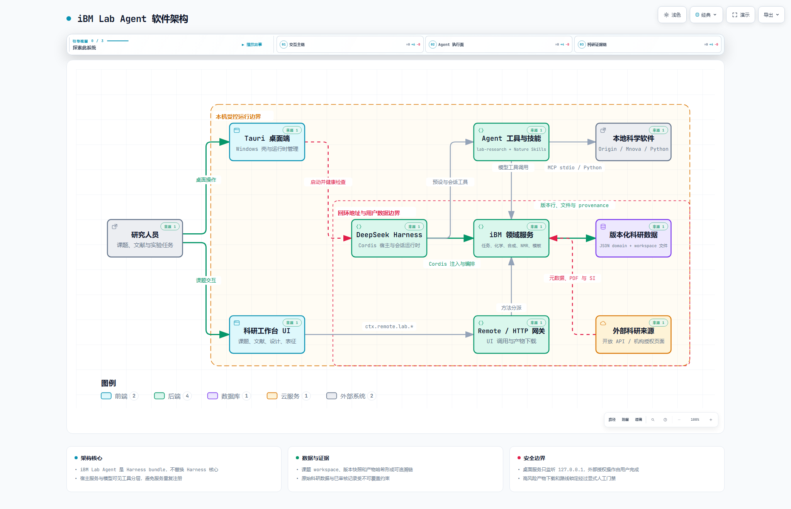
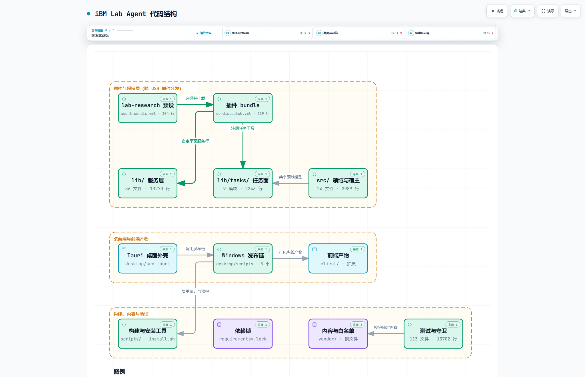

# iBM Lab Agent

iBM Lab Agent 是面向科研课题组的本地科研工作台。项目以
[DeepSeek Harness](https://github.com/deepseek-ai/deepseek-harness) 插件形式运行，
不修改 Harness 核心，并集成固定版本的
[nature-skills](https://github.com/Yuan1z0825/nature-skills)。

当前稳定版本为 **v0.5.8**（界面简化与视觉改版 + 三项修复）。这一版把课题工作台从
「多层卡片 + 小字号」改成「分组标题 + 条目列表」：产品品牌只保留一处，顶部工具栏统一
36px（文件夹 / 更多 / 课题入口同规格，WebVPN 与连接状态合并为紧凑状态入口），课题页改成
单行下划线标签页并去掉「文献资料」等外层大框，精读条目以**短引用主标题 + 中文副标题**
呈现，精读 / PPT 的完成状态改用按钮填充色与完成图标表达，指定的常驻解释文字全部删除，
条目字号整体放大。同时修掉三处问题：阅读模板列表因描述符漏声明参数而始终报
`expected 0 argument(s), got 1`（同类漏声明的 `synth_step_set_structure` /
`synth_step_resolve_dual` 一并补上）；模板管理新增**全局唯一的默认模板**，设置后 Agent
生成笔记时优先使用；新建对话默认进入 `lab-research`（iBM 科研 Agent）模式，桌面壳顶栏
新增常驻课题入口，空白新会话里也能一键回到课题空间。
发布说明见 [`docs/releases/v0.5.8.md`](docs/releases/v0.5.8.md)，
上一稳定版说明见 [`docs/releases/v0.5.6.md`](docs/releases/v0.5.6.md)。

v0.5.6-beta2 把文献捕获的字节来路收敛成**两条真机确认过的通路**：出版社定制 PDF 预览页点
页面上的下载控件（下载事件），浏览器原生 PDF 由 CDP `Fetch` 在响应阶段取原始正文；
旧的响应层取体（含 `206` 分段装配）**退役**。归档行为同时收紧：条目已有同类型文件时
**明确失败**而不再静默覆盖，Agent 拿到成表的 `reasonCode`；**关掉文献浏览器窗口即任务终止**。
需求与技术方案见 [`docs/0.5.7_LITERATURE_CAPTURE_REQUIREMENTS.md`](docs/0.5.7_LITERATURE_CAPTURE_REQUIREMENTS.md)，
操作手册见 [`docs/LITERATURE_DOWNLOAD_CHAIN.md`](docs/LITERATURE_DOWNLOAD_CHAIN.md)。

v0.5.5-beta2：在 beta1 修掉 0.5.4 试用复盘七条问题、让 Agent 优先使用
**桌面壳自带运行时**的基础上，**渲染助手改用 DSH 自带的 LibreOffice**（Windows 341 MB native /
Linux 186 MB wasm，随安装包分发），用户不再需要自己装 LibreOffice；宿主 soffice 仅为兜底。

v0.5.4 把 Windows 捆绑 Python 升到 3.12（与 Linux 线对齐），并接入
`pptx-cli` 完成文献阅读 PPT 模板的声明式规范（P1–P4）。

v0.5.3-beta9 的主题是把插件适配到 **DeepSeek Harness 0.1.7-rc.1**。
0.1.7 删除了「预设目录」（`$DSH_HOME/.agent-presets/<id>/` 的 `preset.yml` +
`agent.cordis.yml`）这一整套契约，改用 bundle patch 里的
`@deepseek-ai/dsh-agent-preset` 声明行，默认预设也从 `settings.yaml` 的
`agent-presets:` 段改为 `agent-preset-registry` 行的 `config.default`——
旧写法在 0.1.7 上**不报错、只是静默失效**（新会话不再默认科研 Agent）。本版把
preset 改成随 `dsh-lab-agent` bundle 分发的第二个 patch 层
（`presets/lab-research/preset.patch.yml`），默认预设由安装器写进
profile 的 `cordis.patch.yml`，因此 `--keep-default-preset` 仍然有效。同时修掉
两个会导致客户端整体失效/出包退化的破坏性改动：浏览器侧 strict codec 的字段
`schema` → `create`（不改则 `$mount` 抛错、角标与侧栏全部不注册），以及内嵌
WebView 剪贴板回退补丁的压缩锚点（0.1.7 重写了 JSON 树复制、重命名了 helper，
旧锚点完全失配，会让桌面端每次出包都全量重拷 DSH 树）。此外 0.1.7 把 DSH 内部
依赖改成了 peerDependencies，安装器的 `npm ci --omit=peer --legacy-peer-deps`
会把它们全部跳过，已改为安装 peer 依赖。沿用 beta8 修掉的软件内浏览器页面位移
问题，以及 beta7/beta6 的精读模板真实章节解析、PPT 按模板构建与符合性检查、
软件内浏览器右侧栏、课题资源 tab、捕获小球与 iWAN 直连修复。首要应用方向仍为
聚前药与高分子材料研究。

**[下载 Windows x64 安装包](https://github.com/cyx1874cyx/iBM-Lab-Agent/releases/download/v0.5.1/iBM.Lab.Agent_0.5.0_x64-setup.exe)** ·
[查看 v0.5.1 Release](https://github.com/cyx1874cyx/iBM-Lab-Agent/releases/tag/v0.5.1) ·
[SHA-256 校验文件](https://github.com/cyx1874cyx/iBM-Lab-Agent/releases/download/v0.5.1/SHA256SUMS-v0.5.1.txt)

安装包 SHA-256：以发布产物同目录的校验文件和最终构建报告为准。

## 主要能力

| 模块 | 当前实现 |
|---|---|
| 课题工作台 | 一个课题对应一个独立 workspace；会话共享课题绑定、版本化核心记忆和科研产物索引 |
| 文献工作流 | 多源检索、去重、RIS 汇总、DOI 核验、PDF/SI 捕获、精读报告、文献 PPT 与人工审核；支持软件内 WebVPN、iWAN 状态监视和出版社下载规则 |
| 合成路线 | 靶标、路线、逐步条件、结构式、开放来源证据、可行性检查、版本修订与人工锁定；支持单步骤全宽翻页和结构统一渲染 |
| 化学与高分子计算 | 化学实体及来源登记、分子量与聚合物指标计算、实验方案审核、CAS 授权边界 |
| NMR 与表征 | 直接提交 FID/ZIP 与 MOL 等结构文件，Agent 自动建任务、预检、标峰、生成报告并归档；登记结构判断与 High/Medium/Low 置信度，支持保留历史的重新登记 |
| 绘图登记 | 按课题记录主题、日期、产物引用和来源，可修改、删除并检查文件状态 |
| 模板与文档 | 阅读笔记和 PPT 模板版本化；DOCX/PPTX/XLSX/PDF 转换、预览、哈希与 provenance |
| 桌面集成 | Windows Tauri 客户端，内置 Node、DSH、Python、Origin MCP、Mnova MCP 与离线查看器 |
| 质量与安全 | 原始数据不可覆盖、产物 SHA-256、人工审核门禁、路径边界和回环接口校验 |

内置的 19 个 Nature Skills 负责检索、阅读、写作、引用、绘图和学术交付等内容流程；
本插件负责课题组织、工具路由、任务状态、模板、版本、产物登记和安全门禁。

## 架构



软件架构给出组件与边界：桌面端与 Web 客户端、DeepSeek Harness 宿主、iBM 领域服务与
Agent 工具层，以及「本机受控运行边界」和「回环地址与用户数据边界」两条安全边界。
可交互版本（四条主线视图、深色主题与导出）见
[`docs/ibm-agent-architecture.html`](docs/ibm-agent-architecture.html)。



代码结构给出仓库分层：插件与领域层（`cordis.patch.yml`、`presets/lab-research`、`lib/`、`src/`）、
桌面端与前端产物（`desktop/`、`client/`、`browser-extension/`）、构建内容与验证
（`scripts/`、`python/`、`vendor/`、`tests/`）。图中每个组件都带
[`docs/ibm-agent-code-structure.archify.json`](docs/ibm-agent-code-structure.archify.json) 里的
`sources`（文件与行号），渲染前由 Archify 逐条核对存在性，因此图与代码不会脱节。
可交互版本见 [`docs/ibm-agent-code-structure.html`](docs/ibm-agent-code-structure.html)。

安装包内的自包含运行时（解包后）：`resources/python` 385 MB、`resources/dsh` 648 MB、
`resources/node` 88 MB、`resources/plugin` 58 MB；压缩后 Windows 安装包 259 MB、
Linux 归档 24.1 MB。DSH 树从 318 MB 涨到 648 MB 是 0.1.7 带来的：
`dsh-web-app` 直接依赖 `dsh-office-to-pdf` → `libreoffice-kit`，其 Windows x64 平台包
解包后 325 MB，而组合出的 profile 里 `office-to-pdf` 行是启用状态，不能删。

所有课题数据默认保存在用户自己的 DSH 数据目录。文献访问仅使用开放来源、用户已建立的
学校 WebVPN 会话或本机 iWAN 网络；浏览器捕获只接收用户已获授权的 PDF/SI。项目不会
自动执行实验、采购，也不会绕过机构或 CAS 授权边界。

图形资产的源码、HTML、多尺寸 PNG 与重新生成方式见
[`docs/LINUX_MIGRATION_BASELINE.md`](docs/LINUX_MIGRATION_BASELINE.md) §23。

## Linux 安装

支持 Ubuntu/Debian 的 x86_64 与 arm64。稳定安装命令固定到 **v0.5.1**，在用户目录中创建
隔离的 Node、DSH、pnpm 与 Python 环境，并可直接启动 Web 界面：

```bash
curl -fsSL https://git.ustc.edu.cn/qbdeng2025/iBM-Lab-Agent/-/raw/v0.5.1/install.sh | bash -s -- --start
```

系统包安装阶段会按需请求 `sudo`；模型密钥不包含在发行包中，请在首次打开 DSH 后配置。
常用命令：

```bash
ibm-lab-agent status
ibm-lab-agent logs -f
ibm-lab-agent doctor
ibm-lab-agent restart
ibm-lab-agent stop
ibm-lab-agent dsh --help
```

重新运行安装命令即可幂等升级；使用 `--ref <tag|branch|commit>` 可指定版本。安装器在新
release 通过验证后才切换 `current`，不会直接覆盖上一个可运行版本。完整说明见
[`docs/LINUX_RELEASE.md`](docs/LINUX_RELEASE.md)。

从 Windows 更新 Linux 服务器，可运行：

```powershell
powershell -ExecutionPolicy Bypass -File .\scripts\update-server.ps1 -Ref main
```

也可双击仓库根目录的 `update-server.cmd`，按 SSH 提示输入凭据。脚本不会保存密码。

## Windows 桌面端

`desktop/` 是 Tauri 2 桌面客户端。运行时与用户数据隔离，服务只监听本机回环地址；
API Key 使用当前 Windows 用户的 DPAPI 加密保存。Origin 自动化需要已安装 Origin，
Mnova GUI/Verify 工作流需要已安装并授权的 MestReNova；文件型 NMR 分析不依赖 Mnova GUI。

桌面端顶部提供“检查更新”。它从 USTC GitLab 的最新 Release 读取版本与 Windows x64
安装包，只在远端语义版本更高时允许下载；安装包保存到当前用户的“下载”目录，且必须与
Release 说明中的 SHA-256 一致，之后才会显示“安装并退出”。缺少安装包或校验值时不会
执行自动更新，也不会把预发布版降级到较旧的稳定版。

正式安装包由本地统一发布流水线生成并复验，再直接上传到 GitHub Release，不依赖 GitHub
Actions 构建。安装包大小和 SHA-256 由统一发布流水线写入最终构建报告。

发布构建统一使用：

```powershell
powershell.exe -NoLogo -NoProfile -ExecutionPolicy Bypass -File .\desktop\scripts\build-windows-release.ps1 `
  -SourceRoot . -NodeExe (Get-Command node).Source
```

发布脚本同时支持 Windows PowerShell 5.1 和 PowerShell 7.x；也可将上述
`powershell.exe` 换成 `pwsh`。

该入口依次执行源码测试、回归、预设检查、lint、运行时准备、Web 冒烟、Tauri/NSIS
构建和安装包验证，并输出阶段日志与 `release-report.json`。首次完整构建需要 Rust stable、
Microsoft C++ Build Tools、Node 24 及可访问的依赖源。不要并发启动多个资源准备或发布任务。
详细说明见 [`desktop/README.md`](desktop/README.md) 和
[`desktop/docs/release-checklist.md`](desktop/docs/release-checklist.md)。

## 源码开发

基础要求：Node.js 20 或更高版本；Windows 桌面端还需要 Rust stable 与 MSVC 工具链。

```bash
corepack pnpm install --frozen-lockfile
corepack pnpm run build:client
corepack pnpm run check:preset-exports
corepack pnpm test
corepack pnpm run test:browser
corepack pnpm run regression
corepack pnpm run lint
```

桌面端源码测试：

```powershell
cargo test --manifest-path .\desktop\src-tauri\Cargo.toml --locked
```

Tauri 默认要求已准备完整打包资源。只做源码级 Rust 诊断时可临时覆盖资源清单；正式安装包
必须通过统一发布脚本生成，不得清空资源清单。

手动部署到已有 DSH 环境：

```bash
node scripts/dev-link.mjs
node scripts/install.mjs --strict
node scripts/lab-doctor.mjs
dsh plugin --profile ibm-lab add "$PWD"
dsh --profile ibm-lab
```

新会话使用 `lab-research` 预设。每个课题的核心记忆同步到其 workspace 根目录下的
`项目记忆.md`；更新通过版本化工具完成，不应直接把整份记忆重复塞入对话输入框。

## 当前版本锁定

| 组件 | 版本 |
|---|---|
| iBM Lab Agent | 0.5.8 |
| DeepSeek Harness | 0.1.7-rc.1 |
| Windows Node | 24.16.0 |
| Linux Python | 3.12.11 |
| Windows bundled Python | 3.12 |
| Origin MCP | 0.1.4 |
| Mnova MCP | 0.3.1 |
| Nature Skills | commit `c171989db699bd601d4373912b3fb8db96ecc95b` |

精确版本、哈希和依赖清单分别记录在 `runtime/versions.env`、`harness.lock.json`、
`vendor.lock.json` 与 `desktop/docs/release-manifest.json`。

## 验证状态

当前分支（含 v0.5.8 的全部改动）在本机实测（出包结果见本节末）：

- Node 单元与集成测试 **787 项 / 785 通过 / 0 失败 / 2 跳过**（跳过项需要真实 PPT
  模板，CI 预期如此）；本轮新增 `tests/unit/client-descriptors.test.mjs`（描述符 ↔ 调用点
  ↔ Host 服务三方一致性）与 `tests/unit/ui-redesign.test.mjs`（§2–§9 验收清单）；
- 回归套件 **11/11** 通过；Linux 发布预检闸门全绿；客户端一致性、预设导出检查通过；
  ESLint **0 error / 85 warning**；
- **PPT 链路端到端实测**（真实模板 `956b7abf…` + 真实 5 页计划）：`lint`（模板体检）→
  `compile`（容量自算 15 行 vs pptx-cli 19 行、按图片比例选版式 fig3→fig1）→
  `build --compiled`（`ok=true, errors=0`）→ 成品体检（字体三槽 Arial/微软雅黑/Arial、
  最小字号 20pt、0 error）→ Windows 上渲染出 contact sheet 人工核对；
- **运行时环境实测**（Windows）：`lab_runtime_env` 解析出 `python=bundled` /
  `node=bundled v24.16.0` / `tempDir=<工作区>/.lab-tmp` / `isolated=true`；
  `render-deck.mjs` 把 pptx→pdf→png 全落在工作区内，退出码 0；
- **DSH 0.1.7-rc.1 组合实测**：以真实 0.1.7 依赖闭包挂载 `ibm-lab` profile
  （`dsh-base` + `dsh-web-app` + `dsh-lab-agent`）后，`agentPresets.list()` 返回
  `standard / ptc / minimal / cordis / lab-research`，其中 `lab-research` **无 `broken`
  诊断**（声明里的 25 行全部在真实宿主里激活成功），`defaultId` 为 `lab-research`
  （来自 profile patch 覆盖），`readDocument()` 返回完整 `!!js` 组合；
- 宿主侧 fake-`<invoke>` 补丁锚点在 0.1.7 的
  `@deepseek-ai/dsh-agent-loop/lib/index.js` 上仍然命中，`runtime/versions.env`
  的 `DSH_AGENT_LOOP_SHA256` 已换成 0.1.7 的实测值；
- 浏览器侧剪贴板补丁按 0.1.7 的新压缩形态重取锚点（旧锚点在 0.1.7 上一个都不匹配），
  并做成多布局表；集成测试对真实钉住的前端跑完补丁后执行 `node --check`，
  `verify`/`patch`/`revert` 三态都经过实测前端校验。

v0.5.8 于 2026-10-01 完成出包验证：统一发布流水线 10 个阶段全部通过（含 786 用例、
打包后真实启动的回环 Web 冒烟），`publishable: true`。产物：

| 产物 | 字节 | SHA-256 |
|---|---|---|
| `iBM Lab Agent_0.5.8_x64-setup.exe` | 259,235,080 | `90531204…facf8740` |
| `ibm-lab-agent-v0.5.8-linux.tar.gz` | 24,640,212 | `c39a64f6…6643f4fa` |

两者均由提交 `93154ce` 构建，校验清单在 `dist/SHA256SUMS`。详见
[`docs/releases/v0.5.8.md`](docs/releases/v0.5.8.md)。

v0.5.5-beta3 于 2026-09-25 完成出包验证：统一发布流水线 11 个阶段全部通过（含 695 用例、
打包后真实启动的回环 Web 冒烟），`publishable: true`；Linux 侧预检闸门全绿。产物：

| 产物 | 字节 | SHA-256 |
|---|---|---|
| `iBM Lab Agent_0.5.5-beta3_x64-setup.exe` | 259,051,719 | `C8DC709B…1A6E0EDA` |
| `ibm-lab-agent-v0.5.5-beta3-linux.tar.gz` | 24,368,753 | `7fe4b9a9…427e8b81` |

两者均由提交 `86327eb` 构建。详见 [`docs/releases/v0.5.5-beta3.md`](docs/releases/v0.5.5-beta3.md)。

v0.5.5-beta2 于 2026-09-25 完成出包验证：统一发布流水线 11 个阶段全部通过（含 695 用例、
打包后真实启动的回环 Web 冒烟），`publishable: true`；Linux 侧预检闸门全绿。产物：

| 产物 | 字节 | SHA-256 |
|---|---|---|
| `iBM Lab Agent_0.5.5-beta2_x64-setup.exe` | 259,098,479 | `67188B9E…0FA85B67` |
| `ibm-lab-agent-v0.5.5-beta2-linux.tar.gz` | 24,361,125 | `0d55504d…9630f291` |

两者均由提交 `ce41dc6` 构建。详见 [`docs/releases/v0.5.5-beta2.md`](docs/releases/v0.5.5-beta2.md)。

v0.5.5-beta1 于 2026-09-25 完成出包验证：产物 `iBM Lab Agent_0.5.5-beta1_x64-setup.exe`
（259,060,614 B，`9D915B38…0191AF08`）与 `ibm-lab-agent-v0.5.5-beta1-linux.tar.gz`
（24,353,322 B，`4a58d00a…75c9645f`），均由提交 `7c32532` 构建。详见
[`docs/releases/v0.5.5-beta1.md`](docs/releases/v0.5.5-beta1.md)。

v0.5.4 于 2026-09-25 完成出包验证：产物 `iBM Lab Agent_0.5.4_x64-setup.exe`
（259,027,217 B，`17E51C6F…5EA21F46`）与 `ibm-lab-agent-v0.5.4-linux.tar.gz`
（24,273,322 B，`89f22b44…b9dfefb8`），均由提交 `2b6463f` 构建。详见
[`docs/releases/v0.5.4.md`](docs/releases/v0.5.4.md)。

v0.5.3-beta8 于 2026-09-23 完成出包验证，详见
[`docs/releases/v0.5.3-beta8.md`](docs/releases/v0.5.3-beta8.md)；浏览器页面位移已收敛到
PDF 预览器，人机验证框与 PDF 预览器工具栏需按该文档末尾的清单在真实出版社页面上人工验收。

v0.5.1 于 2026-09-17 完成正式发布验证：

- Node 单元与集成测试全部通过；
- 回归套件 **11/11** 通过；
- 客户端一致性、预设导出、ESLint 和真实浏览器 Ketcher 验收通过；
- 固定版本 Nature Skills、Harness 依赖、Python 锁定、NMR、合成与任务链路验证通过；
- 桌面运行时准备、Web 冒烟、Tauri/NSIS 构建和最终安装包复验通过；
- Release 安装包的 GitHub 远程摘要与本地 SHA-256 一致。

真实 Origin/Mnova GUI 操作和机构授权下载仍需在具有相应商业软件、许可证及校园访问权限的
目标机器上验收；系统会在依赖不可用时显式失败，不会伪造科研产物。

## 目录

```text
bin/                CLI 入口
browser-extension/  本机 PDF/SI 捕获桥
client/             DSH Web 客户端与离线查看器
desktop/            Windows Tauri 客户端及发布脚本（src-tauri 为 Rust，scripts 为 PowerShell）
docs/               发行说明、设计/验收记录与图形资产（*.archify.json + HTML + PNG）
lib/                插件服务层：lib/tasks/ 9 个模块，以及 capabilities/adapters/applications
presets/            lab-research 预设
python/             两条线的固定依赖锁与 Python 辅助脚本
runtime/            Linux 发行版版本与系统依赖
scripts/            安装、发布、审计与预检脚本
src/                领域模型与宿主补丁模块
tests/              单元、集成、浏览器、回归与 E2E 测试（113 个文件）
vendor/             固定版本 Nature Skills 与 mnova-mcp（受白名单裁剪）
cordis.patch.yml    插件 bundle：宿主平面服务注册
install.sh          Linux 一键安装（8 步）
```

## 许可证

本项目使用 [MIT License](LICENSE)。内置 Nature Skills 使用 Apache-2.0；第三方运行时
组件保留各自许可证与 notices。
