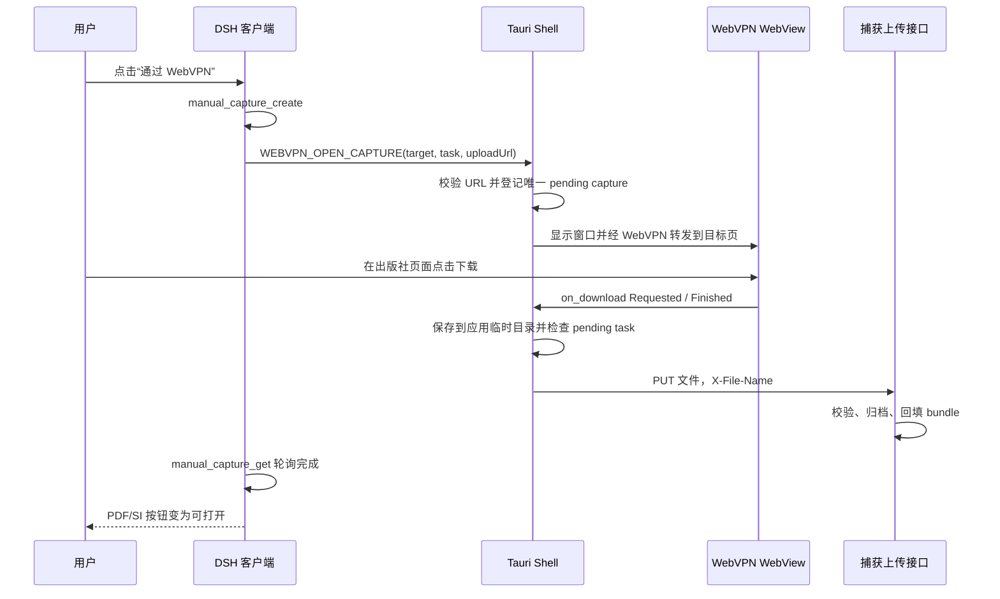

# WebVPN 软件内浏览器与文献捕获开发计划

> 面向开发 Agent 的实施文档。建议随下一个功能版本发布（建议版本号 `0.4.4`）；本文只规划本需求，不改变当前 `0.4.3` 修复范围。

## 1. 需求目标

在 Windows 桌面版中增加一个由应用管理的 WebVPN 浏览器窗口：

1. 用户点击“WebVPN”后，在软件内完成学校统一身份认证、验证码或二次验证。
2. 该窗口在应用运行期间保持同一个浏览器会话；用户关闭窗口时只隐藏，之后再次打开或跳转文献时继续复用登录态。
3. 用户从文献搜索结果、项目文献包或全文下载任务点击“通过 WebVPN”后，应用将 DOI/出版社页面交给 WebVPN 转发，并直接进入目标网站。
4. 用户在出版社页面触发 PDF 下载后，应用捕获下载文件，复用已有一次性捕获任务、文件校验和项目归档链路。
5. 原有开放获取下载和外部 Edge 捕获保留，作为自动路线和回退路线。

本需求中的“保持登录状态”指保持 WebView 的 Cookie、Local Storage 和 WebView2 会话环境。应用不得读取、导出或记录用户的学校账号、密码、Cookie、SSO ticket。

## 2. 当前工程分析

### 2.1 已有能力

- `client/src/components-project.js` 的 `LitPanel` 已能为缺失的 PDF/SI 创建 `manual_capture_create` 一次性捕获任务，随后轮询 `manual_capture_get`。
- `lib/manual-capture.js` 已实现 `PUT /api/lab-capture-upload?token=...`，包括任务绑定、20 分钟有效期、100 MB 限制、文件名清洗、PDF/SI 校验、临时文件与原子落盘，并通过 `LabTasksService.registerCapturedFile` 回填原 bundle。
- `desktop/src/index.html` 与 `client/src/lib.js` 已有基于 `window.postMessage` 的 DSH 页面到 Tauri shell 桥接，当前支持 `OPEN_IN_EDGE` 和 `OPEN_ARTIFACT_IN_BROWSER`。
- `desktop/src-tauri/src/main.rs` 已有外部 Edge 打开逻辑和主窗口关闭时的 runtime 回收逻辑。
- `src/literature/data-sources.js`、`lib/literature-sources.js` 已定义机构访问会话及 `waiting-login` 等状态；`cordis.patch.yml` 当前桌面模式为 `desktop-edge-handoff`。
- `desktop/src-tauri` 使用 Tauri 2.11.x。当前依赖提供 `WebviewWindowBuilder::data_directory`、`on_navigation`、`on_new_window` 和 `on_download`，可以实现独立持久化 WebView2 会话及下载回调。

### 2.2 当前链路


现有链路的归档和安全边界已经完整。新功能应替换“外部 Edge + 扩展”这一段，不应新建第二套文献存储、文件命名或 bundle 更新逻辑。

### 2.3 关键缺口

1. 桌面端没有长期存活的第二 WebView 窗口。
2. 客户端没有 WebVPN 的配置、状态和操作消息。
3. 尚未确认中国科学技术大学 WebVPN 将任意 URL 转成代理地址的真实规则。截图只能证明页面支持输入目标 URL，不能据此硬编码路径或参数。
4. WebView 下载完成后还没有将本地临时文件上传到一次性捕获端点的 Rust 流程。
5. 内嵌 PDF、弹窗、重定向、登录失效等真实出版社行为需要专项验证。

## 3. 范围

### 3.1 MVP 范围

- Windows 桌面版。
- 单例 WebVPN 窗口；同一时间只允许一个待捕获任务。
- 用户手动登录，应用不保存凭据。
- 支持 WebVPN 门户内输入 URL 并转发。
- 支持由浏览器下载事件产生的 PDF 和 PDF 格式的 SI。
- 复用现有捕获任务和归档接口。
- 提供状态、重试、取消、清除登录状态和外部 Edge 回退。

### 3.2 后续范围

- 自动判断登录成功、自动刷新会话。
- 同时捕获多个文件或多个 WebVPN 窗口。
- 自动提取已在页面内渲染但未触发下载的 PDF。
- macOS/Linux 适配。
- 存储学校账号密码、绕过验证码或二次验证。

## 4. 目标架构

必须使用独立的 Tauri WebView 窗口，不要把 WebVPN iframe 嵌入 DSH 页面，也不要把 WebVPN 加载到主 WebView。第三方站点常见的 CSP、`X-Frame-Options`、SSO 跳转和 Cookie 隔离会使 iframe 方案不稳定；主 WebView 还承载本地 DSH，混用安全上下文会扩大风险。



### 4.1 WebView 生命周期

- 窗口 label 固定为 `webvpn`，创建前先查询现有窗口，禁止重复创建。
- 使用专属 `data_directory`，例如应用数据目录下的 `webvpn-webview2`，与主窗口和其他浏览器隔离。
- 用户点击窗口关闭按钮时阻止销毁并执行 `hide()`；再次点击“WebVPN”只 `show + focus`。
- 主应用退出时正常销毁窗口并停止运行时。
- MVP 默认允许 profile 跨应用重启保留，以减少重复登录；设置页必须提供“退出 WebVPN / 清除登录状态”。该操作销毁 WebVPN 窗口、清理专属 profile 后重新创建，且必须由用户主动触发。

### 4.2 会话状态

统一使用以下状态，避免 UI 根据 URL 文案猜测：

| 状态 | 含义 | UI 行为 |
|---|---|---|
| `closed` | 尚未创建窗口 | 显示“打开 WebVPN” |
| `opening` | 正在创建或加载门户 | 禁用重复点击 |
| `waiting-login` | 门户已打开，等待用户完成登录 | 显示“我已登录”与“打开窗口” |
| `ready` | 用户已确认可使用 | 允许发起跳转 |
| `navigating` | 正在转发目标页 | 显示目标域名 |
| `waiting-download` | 已到目标页，等待用户点击下载 | 提示用户操作 |
| `uploading` | 文件正在上传和校验 | 禁用新的捕获任务 |
| `expired` | 捕获任务过期或会话失效 | 提供重新登录/重试 |
| `error` | 导航、下载或上传失败 | 显示可操作错误及 Edge 回退 |

`ready` 在 MVP 中由用户点击“我已登录”确认。URL 或 DOM 只能作为辅助提示，不能把“门户页面加载完成”当作登录成功。

### 4.3 待捕获任务

Rust 侧维护一个 `PendingCapture`，最少包含：

```text
task_id
kind                  // pdf | si
target_url             // 已规范化的 https URL
upload_url             // 当前 DSH loopback 上的精确上传 URL，含一次性 token
expires_at
expected_file_type     // MVP: application/pdf / .pdf
generation             // 防止旧下载回调污染新任务
```

状态转移必须原子化。同一时刻收到第二个任务时返回“已有文献正在捕获”，由 UI 引导用户完成、取消或等待；不要覆盖旧任务。

## 5. WebVPN 转发适配器

### 5.1 第零阶段必须先做现场探测

开发前使用真实 USTC WebVPN 完成以下探测，并把结果记录为测试夹具或开发注释：

1. 登录后手动输入一个 Nature DOI URL，记录提交后的完整导航链和最终代理 URL 结构。
2. 再测试 ACS、ScienceDirect 和一个带 query 的 URL，确认编码规则、重定向和跨域行为。
3. 关闭并重新显示同一 WebView，确认登录态仍在。
4. 重启应用，确认专属 data directory 是否按产品策略复用登录态。
5. 测试目标页面通过当前页、`target=_blank` 和脚本弹窗打开时的行为。
6. 测试 PDF 是附件下载还是 WebView 内联预览。

在上述结果确认前，不得根据截图猜测 WebVPN 的路径拼接规则。

### 5.2 适配器接口

在 Rust 层定义 provider 接口，首个实现命名为 `ustc-webvpn`：

```text
open_portal()
navigate_target(target_url)
is_portal_url(url)
is_allowed_login_redirect(url)
redact_for_log(url)
```

优先使用现场确认过的稳定转发 URL 模板。若门户没有稳定模板，则只允许在“配置的 WebVPN 门户 origin + 已核验页面特征”上执行最小 DOM 脚本：定位网址输入框、写入目标 URL、触发提交。选择器或页面指纹不匹配时立即停止并提示“WebVPN 页面结构已变化”，不能在任意第三方页面执行点击脚本。

门户 URL 应可配置，默认值须在第零阶段确认后填写；不要把截图中未展示的域名写死。

## 6. 下载与归档设计

### 6.1 下载回调

为 WebVPN WebView 注册 `on_download`：

1. `Requested`：若存在未过期的 `PendingCapture`，将目标路径重定向到应用私有临时目录；路径由应用生成，不接受远端目录片段。
2. `Finished(success=true)`：核对任务 generation 和到期时间，读取临时文件，通过 `PUT {upload_url}` 上传，设置 `X-File-Name` 为 URL 编码后的原始文件名，并采用 `application/pdf`。
3. 服务端成功后清空 pending task、删除临时文件，并向主 shell/客户端广播完成状态。
4. 下载、上传或服务端校验失败时清理临时文件，保留可重试的错误信息，并使一次性 token 按现有服务端状态处理。
5. 没有 pending task 时不得静默归档下载。采用 WebView 默认下载行为或提示用户先从文献条目发起捕获。

服务端 `lib/manual-capture.js` 继续作为文件类型、大小、完整性、路径和归档归属的最终裁决者。Rust 的预检查只用于尽早报错，不能替代服务端校验。

### 6.2 内联 PDF 限制

不少出版社会在浏览器 PDF viewer 中打开文件，不触发下载事件。MVP 的界面必须提示：“已打开目标页面，请点击网页或 PDF 查看器中的下载按钮”。只有 `on_download` 产生的文件进入捕获链路。

不要通过注入脚本读取 WebVPN Cookie 后自行请求 PDF。若后续要支持“捕获当前内联 PDF”，应单独设计只在 WebView2 内部执行且不导出认证材料的方案。

## 7. URL 与安全边界

### 7.1 目标 URL

- 只接受 `https:`。
- 拒绝 `file:`、`data:`、`javascript:`、`blob:`、自定义协议和带用户名/密码的 URL。
- 拒绝 localhost、loopback、链路本地、私网 IP 和应用内部端口。
- 去除 fragment；对可能含 token 的 query 使用现有敏感参数规则清洗日志，但导航可保留业务所需 query。
- 限制 URL 长度，并在 UI 中展示目标 host 供用户确认。
- 优先只接受当前文献 bundle 的 DOI URL、来源 URL或 `src/literature/data-sources.js` 已知出版社域名。

### 7.2 WebVPN 导航

- `on_navigation` 只允许配置的门户、经确认的学校 SSO 域名、WebVPN 代理域名和目标站点的 `https` 导航。
- 弹窗不能直接获得 Tauri IPC。只对允许的登录/代理/出版社 `https` 域名使用共享 WebView2 环境创建受管窗口，或把安全的新窗口导航收敛回 `webvpn` 主窗口；第零阶段按真实站点行为选择。
- 远端 WebVPN 页面不得获得通用 `invoke` 能力，Tauri capability 只授予 `main` shell 所需命令。
- release 构建关闭 WebVPN WebView devtools。

### 7.3 数据与日志

- 不保存学校账号、密码、Cookie、Local Storage 内容或 SSO ticket。
- profile 目录只能由 WebView2 使用，不纳入项目备份、诊断包或同步。
- 日志只记录 `taskId`、状态、目标 host 和错误类别；不得记录完整上传 URL、一次性 token、完整 SSO URL 或响应正文。
- 清除登录状态时只删除已解析并验证位于应用数据目录下的专属 profile，防止目录逃逸。

## 8. 客户端交互

### 8.1 文献数据库页

在 `DatabaseOverview` 上方增加全局 WebVPN 卡片，而不是为 Nature、ACS 等每个来源创建一个 WebVPN 数据源。WebVPN 是访问通道，不是文献来源。

卡片包含：

- “打开 WebVPN”/“返回 WebVPN”按钮。
- 当前状态和最近错误。
- “我已登录”确认按钮。
- “清除登录状态”入口。
- 门户地址配置入口，保存前校验为公网 `https`。

### 8.2 文献条目

对缺失 PDF/SI 的按钮提供：

- 主操作：“通过 WebVPN”。
- 回退操作：“使用外部 Edge”。
- WebVPN 未配置或未确认登录时，点击主操作先打开登录窗口，并保留用户最初选择的条目；登录确认后继续创建捕获任务。

项目 bundle 和搜索结果使用同一组件/操作函数，避免当前两处缺失文件按钮行为不一致。已归档文件仍按现有逻辑打开，不经过 WebVPN。

### 8.3 全文下载队列

开放获取自动下载保持第一优先级。机构下载进入 `waiting-login` 或失败且存在 landing URL 时，增加“通过 WebVPN 打开”操作，将该任务的 DOI/landing URL 转给同一 WebVPN 窗口。成功捕获后继续由现有 bundle 状态驱动 UI。

## 9. Shell 消息与命令契约

客户端仍通过主 shell 桥接，第三方页面不直接调用 Tauri：

| 客户端消息 | Tauri 命令 | 结果 |
|---|---|---|
| `WEBVPN_STATUS` | `webvpn_status` | 配置、会话状态、pending task 摘要 |
| `WEBVPN_OPEN_LOGIN` | `webvpn_open_login` | 创建/显示单例窗口 |
| `WEBVPN_CONFIRM_LOGIN` | `webvpn_confirm_login` | 状态转为 `ready` |
| `WEBVPN_OPEN_CAPTURE` | `webvpn_open_capture` | 登记任务并跳转目标 |
| `WEBVPN_CANCEL_CAPTURE` | `webvpn_cancel_capture` | 取消匹配 taskId 的任务 |
| `WEBVPN_CLEAR_SESSION` | `webvpn_clear_session` | 销毁窗口并清理专属 profile |
| `WEBVPN_SAVE_CONFIG` | `webvpn_save_config` | 保存并返回脱敏配置 |

所有请求沿用现有 `requestId` 请求/响应模式，并设置明确超时。事件型更新增加 `WEBVPN_STATE_CHANGED`，客户端收到后刷新显示；即使事件丢失，`WEBVPN_STATUS` 也能恢复权威状态。

`WEBVPN_OPEN_CAPTURE` 的 payload 建议为：

```json
{
  "taskId": "capture task id",
  "kind": "pdf",
  "targetUrl": "https://doi.org/...",
  "uploadUrl": "http://127.0.0.1:<runtime-port>/api/lab-capture-upload?token=<one-time-token>",
  "expiresAt": "ISO-8601"
}
```

Rust 必须再次校验每个字段；不能信任 iframe 发来的 URL。`uploadUrl` 只允许当前运行时的 loopback host、当前端口和精确上传路径。

## 10. 按文件实施清单

| 文件/目录 | 主要改动 |
|---|---|
| `desktop/src-tauri/src/webvpn.rs`（新增） | WebVPN manager、窗口创建/隐藏、状态机、URL 校验、provider 适配器、下载临时文件与上传 |
| `desktop/src-tauri/src/main.rs` | 注册 WebVPN state/commands；处理 `webvpn` 关闭事件；应用退出时清理任务和临时文件 |
| `desktop/src-tauri/src/runtime/config.rs` | 增加 `WebVpnConfig` 的兼容序列化与默认值；不得存凭据或 Cookie |
| `desktop/src-tauri/Cargo.toml` | 仅在实现需要时增加异步 HTTP/临时文件依赖；优先复用现有依赖 |
| `desktop/src-tauri/capabilities/default.json` | 保持命令只对 `main` 可用；核对动态 `webvpn` 窗口无 IPC 权限 |
| `desktop/src/index.html` | 增加 WEBVPN 消息分发、参数规范化、requestId 响应和状态事件转发 |
| `client/src/lib.js` | 增加 WebVPN shell helper、统一超时与错误映射 |
| `client/src/components-literature.js` | WebVPN 全局卡片、全文队列入口、登录/错误状态 |
| `client/src/components-project.js` | 抽取统一捕获入口；增加 WebVPN 主路线和 Edge 回退；统一搜索结果与 bundle 行为 |
| `client/src/styles.css` 或现有样式文件 | 状态卡、路线菜单、忙碌/错误/登录提示样式 |
| `lib/manual-capture.js` | 原则上不改；仅在实际 WebView 上传暴露兼容问题时做小范围调整并补回归测试 |
| `src/literature/data-sources.js` | 如需要，增加 transport/UI 枚举；不要把 WebVPN 建成伪数据源 |
| `lib/literature-sources.js` | 将 `waiting-login` 任务与 WebVPN 手动路线对接；OA/managed-edge 逻辑保持兼容 |
| `cordis.patch.yml` | 增加清晰配置注释；是否增加 transport 配置取决于最终所有权，门户配置以桌面端为主 |
| `tests/unit/*webvpn*`（新增） | URL、状态机、消息桥接、配置兼容测试 |
| `tests/integration/*webvpn*`（新增） | 假 WebVPN/登录 Cookie/代理页/附件下载/捕获上传链路 |
| `desktop/scripts/verify-package.ps1` | 增加 WebVPN 命令注册、窗口权限和 release 配置检查 |
| `docs/ARCHITECTURE.md`、`docs/MANUAL_CAPTURE.md` | 更新最终架构、用户流程、限制和排错说明 |

如果仓库的 `client/index.js` 是构建产物，应通过现有构建流程重新生成，不要同时手改源文件与产物。

## 11. 分阶段开发步骤

### 阶段 0：协议与行为探测

- 确认 WebVPN 门户 URL、转发规则、SSO 域名、弹窗和 PDF 下载行为。
- 形成 provider 夹具和允许域名清单。
- 明确“跨应用重启是否保留登录”的产品策略；本计划默认保留并提供清除入口。
- 退出条件：Nature、ACS、ScienceDirect 至少各有一次可复现的手动跳转记录。

### 阶段 1：WebVPN 单例窗口

- 增加配置、manager 和状态查询。
- 实现专属 data directory、创建/显示/隐藏、登录确认、清除会话。
- 实现 URL 导航和弹窗策略，不接下载归档。
- 退出条件：登录一次后隐藏/显示三次，仍能访问三个目标站点且不重复登录、不产生第二窗口。

### 阶段 2：下载捕获闭环

- 接入 `PendingCapture` 和 `on_download`。
- 将临时文件 PUT 到现有 capture upload；处理成功、失败、过期、取消和清理。
- 退出条件：真实 PDF 经 WebVPN 下载后归档到正确 bundle，原客户端轮询可看到完成状态。

### 阶段 3：客户端体验

- 加入全局 WebVPN 卡片和状态事件。
- 统一项目 bundle、搜索结果、全文任务的“通过 WebVPN”操作。
- 增加忙碌提示、内联 PDF 操作提示、失败回退和取消。
- 退出条件：三处入口行为一致，错误信息能明确告诉用户下一步。

### 阶段 4：安全、回归与打包

- 完成 URL/日志/profile 安全测试。
- 完成模拟集成测试和真实 USTC WebVPN 安装包验收。
- 更新文档和打包检查。
- 退出条件：所有自动化检查通过，外部 Edge 捕获、OA 自动下载、已归档文件打开和 DSH 启动/鉴权无回归。

## 12. 测试计划

### 12.1 Rust 单元测试

- 门户 URL、目标 URL、上传 URL 的正反例。
- 私网、loopback、危险 scheme、凭据 URL、超长 URL 拒绝。
- 单例窗口和 close-to-hide。
- `PendingCapture` 的创建、并发拒绝、取消、过期、generation 防串单。
- 临时路径始终位于应用临时目录，文件名不能目录逃逸。
- 下载成功、失败、上传 4xx/5xx、网络中断后的状态和清理。
- 配置旧版本读取和新版本 round-trip，不产生凭据字段。

### 12.2 客户端测试

- 每种 WEBVPN 消息的 requestId、超时和错误映射。
- 未登录时点击文献，登录确认后能恢复原始意图。
- 同一时间第二个捕获任务被友好拒绝。
- WebVPN 失败后外部 Edge 回退仍能创建并完成捕获。
- 搜索结果、bundle、全文队列使用同一目标 URL 选择规则。

### 12.3 模拟集成测试

建立本地假门户，但测试逻辑需保持与生产 URL 校验分离：

1. 登录页写入会话 Cookie。
2. 转发页只有持有 Cookie 才能进入目标页。
3. 隐藏/显示或二次导航后 Cookie 仍存在。
4. 目标页提供 attachment PDF；WebView download 回调捕获文件。
5. 文件上传现有 `/api/lab-capture-upload`，任务完成且 bundle 路径、哈希、状态正确。
6. 模拟 token 过期、错误 MIME、截断 PDF、302 链和 Content-Disposition 文件名。

### 12.4 安装包人工验收

使用正式 release 安装包和真实 USTC WebVPN：

- 登录一次后连续访问 Nature、ACS、ScienceDirect，无重复登录。
- 关闭 WebVPN 窗口后重新打开，会话仍在且只有一个窗口。
- 普通 PDF 与 SI PDF 能归档到正确文献；不会串到另一条文献。
- 页面内联 PDF 时提示准确，点击 viewer 下载按钮后能捕获。
- SSO 弹窗、验证码、二次验证和登录过期可恢复。
- 取消、任务过期、网络中断、上传失败均可重试或切换外部 Edge。
- “清除登录状态”后下一次打开必须重新登录。
- 根据确认的产品策略验证应用重启后的登录态。
- 日志、配置文件和数据库中搜索不到密码、Cookie、token、SSO ticket。

## 13. 验收标准

- [ ] 用户可以从软件内打开并登录 USTC WebVPN。
- [ ] 应用运行期间关闭/再次打开 WebVPN 窗口不会丢失登录态。
- [ ] 连续访问至少三个不同出版社目标不要求重复登录。
- [ ] WebVPN 始终为单例窗口。
- [ ] 文献条目可以创建捕获任务并把目标 URL 交给 WebVPN。
- [ ] 用户点击网页下载后，PDF 经现有接口校验并归档到正确 bundle。
- [ ] 同一时间只捕获一个任务，过期或旧回调不会污染新任务。
- [ ] 内联 PDF、登录失效、网络失败有明确提示和可执行恢复操作。
- [ ] 外部 Edge 捕获和 OA 自动下载保持可用。
- [ ] 应用不保存或记录学校凭据、Cookie、一次性 token、完整 SSO URL。
- [ ] 清除登录状态能彻底重建专属 profile，且不会触碰应用数据目录外的文件。
- [ ] 自动测试、打包检查和真实安装包验收通过。

## 14. 开发 Agent 交付要求

开发 Agent 应按阶段提交，至少提供：

1. 第零阶段的实际 WebVPN 转发规则、允许域名和行为记录。
2. 代码改动及配置迁移说明。
3. 自动测试结果和真实安装包验收记录。
4. 对内联 PDF、弹窗和跨重启会话策略的最终结论。
5. 安全自查：凭据/Cookie/token 日志扫描、WebView IPC 权限、URL 校验和 profile 删除边界。
6. 用户文档：首次登录、通过 WebVPN 下载、登录失效、清除登录状态和外部 Edge 回退。

开发过程中若发现 USTC WebVPN 不提供稳定转发规则，先实现受门户 origin 和 DOM 指纹严格约束的 provider 适配器，并把页面结构变化作为可识别错误返回；不要把站点专用选择器散落在 UI 或通用窗口管理代码中。

## 15. 可直接交给开发 Agent 的启动指令

> 请阅读 `docs/WEBVPN_IN_APP_BROWSER_DEVELOPMENT_PLAN.md` 并按阶段实施。先完成阶段 0，提交 USTC WebVPN 的真实门户地址、转发规则、SSO/弹窗域名、PDF 下载行为和跨窗口/跨重启会话结论；在这些证据确认前不要硬编码截图中未展示的 URL 规则。实现时采用独立单例 Tauri WebView，复用 `manual_capture_create` 与 `/api/lab-capture-upload`，不得读取或保存学校凭据、Cookie、SSO ticket。每个阶段完成后运行对应测试并记录验收证据；保留 OA 自动下载和外部 Edge 捕获作为回退。若现场行为与计划假设不一致，先更新本计划中的接口和验收标准，再继续编码。
