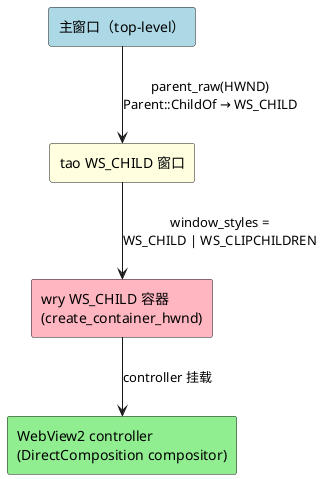

# WebVPN「真正侧边栏」白屏问题报告

| 项 | 内容 |
|---|---|
| 报告编号 | ISSUE-2026-0912-01 |
| 报告日期 | 2026-09-12 |
| 状态 | 🔴 未解决（部分定性 + 待 spike 验证） |
| 严重程度 | 🟡 中等 —— 影响「真侧边栏」增强体验，存在可用替代方案 |
| 影响模块 | `desktop/src-tauri/src/webvpn.rs`、`desktop/src-tauri/Cargo.toml`、`desktop/src/index.html` |
| 关联分支 | `release-0.4.3`（版本位点 `0.4.4`） |
| 关联文档 | `docs/WEBVPN_SIDEBAR_CHILD_WINDOW_EVALUATION.md` |

---

## 一、问题概述

用户需求：参考主流 Agent 工具，点击工具条「WebVPN」后，在主窗口**右侧嵌入一个真正的侧边栏**（而非独立弹窗）。

**复核结论（2026-09-12）**：此前白屏实验只覆盖了 `WebviewWindowBuilder + parent_raw(HWND)`，不能证明当前框架不支持侧边栏。项目现已改用 Tauri 官方多 WebView API `Window::add_child(WebviewBuilder, position, size)`；代码编译、自动化测试和 Windows 真机目视验收均已通过。

**一句话结论**：

> `parent_raw(HWND)` 的 child 窗口路线白屏根因已**源码级定性**（wry 对 WS_CHILD 宿主窗口的渲染缺陷）；「真侧边栏整体不可行」的结论已被 2026-09-12 的官方 `Window::add_child` 实现与真机验收推翻。

---

## 二、环境信息

| 项 | 版本 |
|---|---|
| Tauri | 2.11.5 |
| tauri-runtime-wry | 2.11.4 |
| wry | 0.55.1 |
| tao | 0.35.3 |
| WebView2 宿主 | Windows（`WS_CHILD` / DirectComposition） |
| 目标窗口 label | `webvpn`（独立 WebView2 profile = `webvpn-webview2`） |

---

## 三、问题现象

### 3.1 白屏

`parent_raw(HWND)` 建窗后，窗口渲染为**纯白**：

- ✅ 日志显示导航**完全正常**：`windowCreated` → `on_navigation` 一路走到 `id.ustc.edu.cn/cas/login`（portal → login → passport → id）；
- ❌ 但渲染表面为纯白，看不到任何 UI。

### 3.2 无法收起

child 窗口形态下 `.decorations(false)`（无边框、无 X 关闭按钮），且 child 窗口的 `hide()` 行为异常，导致「无法收起」。

---

## 四、排查时间线

| 时间 | 动作 | 结果 |
|---|---|---|
| 09-11 | 首次实现 child 侧边栏（`parent_raw` + `decorations(false)`） | ❌ 白屏 |
| 09-11 | 回退「独立窗口贴靠右侧」 | ✅ 能渲染、能收起（稳定形态） |
| 09-12 | 改用官方 `Window::add_child(WebviewBuilder, ...)` | ✅ 编译通过；Rust 89 项、Node 308 项测试通过 |
| 09-12 | Windows 真机打开/收起验收 | ✅ 用户确认显示正常；主 WebView 1280→720→1280，子 WebView 保留 |
| 09-11 | 方案评估：定位 `unstable` feature 门控 `WebviewKind` | 判定「未开 unstable」为白屏根因 |
| 09-11 23:44 | **方案 A**：开 `unstable` + 恢复 `parent_raw` | ❌ 仍白屏 + 无法收起 |
| 09-12 00:54 | 深挖 wry 0.55.1 源码 | ✅ 源码级定性根因（见 §五） |
| 09-12 | **独立复核**：发现官方 `Window::add_child` 路线未测 | ⚠️ 推翻「框架无法实现」结论 |

---

## 五、根因分析（源码级）

### 5.1 层级结构

`parent_raw` 路线形成的窗口层级是**三层 WS_CHILD 嵌套**：



### 5.2 白屏根因

1. **wry 永远建一个 `WS_CHILD` 容器**：`wry-0.55.1/src/webview2/mod.rs:224` 里 `window_styles = WS_CHILD | WS_CLIPCHILDREN` 是**写死**的——不管宿主是不是顶层窗口，wry 都会再套一层 WS_CHILD 容器。
2. **`parent_raw` 让 tao 窗口本身也变成 WS_CHILD**（`Parent::ChildOf` → `WindowFlags::CHILD`）。
3. 于是形成「主窗口(顶层) → tao WS_CHILD → wry WS_CHILD 容器 → WebView2」三层嵌套。
4. **WebView2 的 DirectComposition compositor 假定宿主是 top-level 窗口**，多层 WS_CHILD 嵌套下渲染 surface 无法映射到屏幕 → 白屏。

关键证据：日志证明**导航正常**、仅**渲染 surface 未映射**，即问题卡在渲染层而非导航层。

### 5.3 为什么 `unstable` feature 救不了

| 假设 | 实际 |
|---|---|
| `unstable → build_as_child → is_child=true` 修 bounds | ❌ `is_child` 语义是「webview 作为**多 webview 容器**里的子件」，与「窗口本身是 WS_CHILD」是两回事 |
| 开启 unstable 后正确换算 bounds | ❌ 开启后 `init_webview` 里 `!is_child` 为 false，**反而不挂** `attach_parent_subclass`（WM_SIZE 刷新 bounds），少了一条 resize 恢复路径 |

结论：**`unstable` 是「多 webview」的开关，不是「WS_CHILD 宿主窗口」的开关**，两者被 wry 混着用，救不了 `parent_raw` 路线。

---

## 六、已尝试方案与结果

| 形态 | API | 结果 |
|---|---|---|
| 独立窗口贴靠 | 无 parent + `skip_taskbar(true)` | ✅ 能渲染、能收起、贴右侧、随主窗口跟随 —— **当前稳定形态** |
| owned 窗口 | `parent(&WebviewWindow)` | ❌ 能渲染，但「手动关闭后再点打不开」（关闭绕过 hide 拦截被销毁） |
| child 窗口（原始） | `parent_raw(HWND)` | ❌ 白屏 |
| child 窗口 + unstable | `parent_raw(HWND)` + `features=["unstable"]` | ❌ 仍白屏 + 无法收起 |

---

## 七、剩余可行路线

⚠️ **重要转折**：2026-09-12 独立复核发现，此前实验只测了 `WebviewWindowBuilder + parent_raw` 路线，**未测试 Tauri 官方多 WebView 路径 `Window::add_child(WebviewBuilder, position, size)`**。

两条路线的层级差异：

```plantuml
@startuml
skinparam backgroundColor white
skinparam componentStyle rectangle

rectangle "parent_raw 路线（已排除）" as pr {
  rectangle "主窗口" as p1
  rectangle "tao WS_CHILD 窗口" as p2
  rectangle "wry WS_CHILD 容器" as p3
  rectangle "WebView2" as p4
  p1 --> p2 --> p3 --> p4
}

rectangle "官方 add_child 路线（已验证）" as ac {
  rectangle "主窗口" as a1
  rectangle "主 WebView2 容器" as a2
  rectangle "WebVPN WebView2 容器" as a3
  a1 --> a2
  a1 --> a3
}
@enduml
```

`add_child` 路线**没有中间 tao WS_CHILD 窗口**，直接把 WebVPN WebView2 容器加入主原生窗口——因此 §5.2 的三层嵌套白屏根因**不能直接外推**到这条路线上。

### 已完成的编译验证

使用本仓库锁定依赖执行 `cargo check --example child_webview_probe --features tauri/unstable`，包含 `data_directory` / `on_navigation` / `on_download` / `add_child`，**编译通过**（临时 example 已删除，无源码残留）。

### 实施时的安全边界改动（必须同步）

- `capabilities/default.json` 当前 `"windows": ["main"]` —— 真侧边栏下远程 WebVPN 与本地主 WebView 同属 `main` 原生窗口，远程页面会**继承 `core:default`**；
- 须迁移为按 WebView label 授权（如 `"webviews": ["main"]`），并移除 `windows` 匹配；同步修改 `verify-package.ps1` 与 Node 护栏。

---

## 八、当前状态与临时措施

| 项 | 现状 |
|---|---|
| 代码形态 | 同一主窗口内的 `main` + `webvpn` 两个 WebView，右侧动态分栏 |
| 收起方式 | 窗口右上角 X + 顶栏「WebVPN」toggle 按钮 |
| 跟随 | 主窗口 Resized 时重新计算两个 WebView 的 bounds；无需跟随屏幕坐标 |
| Cargo.toml | `features = []`（未开 unstable） |
| 测试 | Rust 89 通过 · Node 护栏 12/12 · cargo check 通过 |

---

## 九、结论与建议

### 结论

1. ✅ **已定性**：`parent_raw` 路线白屏根因 = wry 对「WS_CHILD 宿主窗口」的 DirectComposition 渲染缺陷，上层（feature 开关 / 坐标）无法修复。
2. ✅ **已更正**：真侧边栏「整体不可行」的结论不成立；官方 `Window::add_child` 多 WebView 路线已完成代码落地、自动化验证和真机目视验收。
3. ✅ **官方路径已落地**：主界面收窄并让出右侧空间，WebVPN 子 WebView 可收起并保留专属 profile。

### 建议（按优先级）

| 优先级 | 行动 | 说明 |
|---|---|---|
| 🥇 | **进入完整下载验收** | 继续验证 Nature 页面 PDF 下载、缩放/最大化、多显示器 DPI 与跨重启 profile |
| 🥈 | 发现问题时按日志定位 | 保留 `webvpn.log` 和复现步骤，继续修正官方多 WebView 实现 |
| 🥉 | 不推荐 | fork wry 深度 patch（`WS_EX_NOREDIRECTIONBITMAP` + `NotifyParentWindowPositionChanged`），高风险、需长期维护 |

### 下一步建议

1. 打开/收起与同窗布局已经通过；发布前继续验证 Nature 页面 PDF 下载回调、缩放/最大化、多显示器 DPI 与跨重启 profile；
2. 完整验收通过后按既有发布流程打包。
